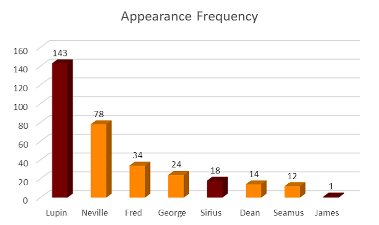

# Measures and Results

## Tools

* **AntConc**: Extract word frequencies and analyze textual data efficiently.
* **Voyant**: Visualize data and extract co-occurrence patterns.
* **Microsoft Excel**: Analyze and chart frequency data.
* **NetworkX**: Assess closeness centrality.

## Frequency Measures

Identifying the frequency of appearance of the select characters would be important to determine the relevance that they have to the story in the specified chapters.&#x20;

The frequency is identified by counting each of the characters’ appearance in all passage of the story, including mise-en-scène, dialogues, and expositions alike. **AntConc** word frequency tool is used with the specific regex:

```regex
[seamus,dean,neville,george,fred,sirius,james,peter,lupin]
```

### Chapters 1-9 Results

| Character | Rank | Appearance Frequency |
| --------- | ---- | -------------------- |
| Lupin     | 1    | 143                  |
| Neville   | 2    | 78                   |
| Fred      | 3    | 34                   |
| George    | 4    | 24                   |
| Sirius    | 5    | 18                   |
| Dean      | 6    | 14                   |
| Seamus    | 7    | 12                   |
| James     | 8    | 1                    |

As seen in this table, **Lupin** as one of “**The Marauders**” is ever present, even before the introduction of “**Marauder’s Map**”.&#x20;

This can be argued as an anomaly since Lupin’s reveal as one of “The Marauders” is revealed during the climax of the story, right before the epilogue of the novel. Therefore, discounting Lupin’s presence, “**Harry’s Hogwarts Friends**” showcase a significance of occurrence before the introduction of “Marauder’s Map”.&#x20;

Interestingly, Peter Pettigrew does not receive a single mention before the introduction of the map, signifying further the minimum significance of “The Marauders” in the particular part of the novel.

<figure><figcaption><p><em>Visualized bar charts of the frequency table for both “Harry’s Hogwarts Friends” and “The Marauders” in Chapter 1-9.</em></p></figcaption></figure>

### Chapters 10-22 Results

| Character | Rank | Appearance Frequency |
| --------- | ---- | -------------------- |
| Lupin     | 1    | 265                  |
| Sirius    | 2    | 121                  |
| Peter     | 3    | 48                   |
| Fred      | 4    | 47                   |
| George    | 5    | 42                   |
| James     | 6    | 34                   |
| Neville   | 7    | 28                   |
| Seamus    | 8    | 6                    |
| Dean      | 9    | 3                    |

With the introduction of “**Marauder’s Map**”, the dynamic changes significantly as “**The Marauders**” takes the spotlight, occupying the top 6 of the frequency of appearance when compared to the previous chapters.&#x20;

Lupin is still ever present, while **Peter Pettigrew** finally makes an appearance and quickly snatches the Top 3 spot in the frequency of appearance. The data scraping is done in the same method with the previous table to avoid any discrepancy and anomalies while trying to compare both datasets.

“**Harry’s Hogwarts Friends**” quickly took a backseat in the relevance of storyline and appearance except for **Fred** and **George** who initially gives Harry the “Marauder’s Map” in Chapter 10 and plays some role before quickly disappearing like their fellow on the group as the plot advances.&#x20;

Although **James** is quintessentially stated as “**The Marauders**” leader, his appearance is still lacking when compared to Fred and George. However, this can be inferred to the fact that his mentions are rather **posthumously**, while other characters present in the mentioned novel is still **alive** and plays an **active** part in the story.

<figure><figcaption><p><em>Visualized bar charts of the frequency table for both “Harry’s Hogwarts Friends” and “The Marauders” in Chapter 10-22.</em></p></figcaption></figure>

## Closeness Centrality Measures

To further identify the phenomenon in terms of closeness centrality, the author scraped data on how close each of the characters’ mention in the story with **Harry** as he is **the protagonist** of the novel, making him the ideal candidate to be the main node of centrality for this particular measure.&#x20;

Similar to the previous measure, the identified period would be **Chapter 1 to 9** of the novel (pre-Marauder’s Map), and **Chapter 10 to 22** of the novel (post-Marauder’s Map). The method used would be using regex via **Voyant** and find how many co-occurrences of each character to Harry Potter. The specified regex would be:

```regex
(?si)(\bharry\b.*?\blupin\b)|(\blupin\b.*?\bharry\b)
```

Above would be an example of a specified regex to find the co-occurences of Lupin and Harry. Then, the number of the **co-occurences** are used as the weight of each edge.

To visualize the resulting measures, the author used **NetworkX**.

### Chapter 1-9 Closeness Centrality


```python
import networkx as nx
import matplotlib.pyplot as plt

# Create an empty graph
G = nx.Graph()

# Add nodes for characters
G.add_nodes_from([
    "Harry Potter", "Seamus Finnigan", "Neville Longbottom", "George Weasley", "Fred Weasley", "Dean Thomas",
    "Sirius Black", "Professor Lupin"
])

# Add edges based on closeness in the text
G.add_edges_from([
    ("Harry Potter", "Seamus Finnigan"),
    ("Harry Potter", "Neville Longbottom"),
    ("Harry Potter", "George Weasley"),
    ("Harry Potter", "Fred Weasley"),
    ("Harry Potter", "Dean Thomas"),
    ("Harry Potter", "Sirius Black"),
    ("Harry Potter", "Professor Lupin"),
])

# Define edge weights based on closeness
edge_weights = {
    ("Harry Potter", "Seamus Finnigan"): 12,
    ("Harry Potter", "Neville Longbottom"): 46,
    ("Harry Potter", "George Weasley"): 22,
    ("Harry Potter", "Fred Weasley"): 33,
    ("Harry Potter", "Dean Thomas"): 13,
    ("Harry Potter", "Sirius Black"): 18,
    ("Harry Potter", "Professor Lupin"): 90,
}

# Set edge weights
for u, v in edge_weights:
    G[u][v]['weight'] = edge_weights[(u, v)]

# Draw the network
pos = nx.spring_layout(G)  # Use spring layout for visualization
nx.draw(G, pos, with_labels=True, node_size=1750, node_color="orange", font_size=8)
nx.draw_networkx_edge_labels(G, pos, edge_labels=nx.get_edge_attributes(G, 'weight'))

plt.title("Character Centrality in Harry Potter and the Prisoner of Azkaban")
plt.show()
```


<figure><figcaption><p>Visualized closeness centrality measures for characters in the datasets within Chapter 1 to 9.</p></figcaption></figure>

As seen in this particular figure, **Lupin** maintains the position as the closest character with the most interaction to Harry, even in the Chapter 1 to 9 before the introduction of “**Marauder’s Map**”.&#x20;

His central presence is noted due to the fact that Lupin arrives as a helpful Professor to Hogwarts without his allegiance towards “**The Marauders**” being mentioned yet. Discounting Lupin, only **Sirius** maintain a degree of closeness towards Harry, while **James** and **Peter** did not receive the sufficient amount of closeness towards Harry to be included in the figure.&#x20;

“**Harry’s Hogwarts Friends**” receive an ample amount of closeness towards Harry, with Neville and Fred as the leaders while George, Dean, and Seamus follows behind.

### Chapter 10-22 Closeness Centrality

```python
import networkx as nx
import matplotlib.pyplot as plt

# Create an empty graph
G = nx.Graph()

# Add nodes for characters
G.add_nodes_from([
    "Harry Potter", "Seamus Finnigan", "Neville Longbottom", "George Weasley", "Fred Weasley", "Dean Thomas",
    "Sirius Black", "James Potter", "Peter Pettigrew", "Professor Lupin"
])

# Add edges based on closeness in the text
G.add_edges_from([
    ("Harry Potter", "Seamus Finnigan"),
    ("Harry Potter", "Neville Longbottom"),
    ("Harry Potter", "George Weasley"),
    ("Harry Potter", "Fred Weasley"),
    ("Harry Potter", "Dean Thomas"),
    ("Harry Potter", "Sirius Black"),
    ("Harry Potter", "James Potter"),
    ("Harry Potter", "Peter Pettigrew"),
    ("Harry Potter", "Professor Lupin"),
])

# Define edge weights based on closeness (adjust as needed)
edge_weights = {
    ("Harry Potter", "Seamus Finnigan"): 6,
    ("Harry Potter", "Neville Longbottom"): 23,
    ("Harry Potter", "George Weasley"): 41,
    ("Harry Potter", "Fred Weasley"): 45,
    ("Harry Potter", "Dean Thomas"): 3,
    ("Harry Potter", "Sirius Black"): 102,
    ("Harry Potter", "James Potter"): 26,
    ("Harry Potter", "Peter Pettigrew"): 39,
    ("Harry Potter", "Professor Lupin"): 195,
}

# Set edge weights
for u, v in edge_weights:
    G[u][v]['weight'] = edge_weights[(u, v)]

# Draw the network
pos = nx.spring_layout(G)  # Use spring layout for visualization
nx.draw(G, pos, with_labels=True, node_size=500, node_color="orange", font_size=8)
nx.draw_networkx_edge_labels(G, pos, edge_labels=nx.get_edge_attributes(G, 'weight'))

plt.title("Character Centrality in Harry Potter and the Prisoner of Azkaban")
plt.show()
```

<figure><figcaption><p>Visualized closeness centrality measures for characters in the datasets within Chapter 10 to 22.</p></figcaption></figure>

Huge differences can be seen when the same method is applied to different dataset, which is **Chapter 10 to 22** of the novel. “**The Marauders**” now maintain the highest closeness of centrality to **Harry**, with **Lupin** as the leader and **Sirius** following close.&#x20;

**Peter Pettigrew** and **James Potter** also makes an appearance with a respectable amount of closeness weight towards Harry within the chapters. However, an anomaly can be seen, with **George** and **Fred Weasley** maintaining a degree of closeness higher than Peter and James.&#x20;

This can be inferred due to their main role in giving Harry “**Marauder’s Map**”, particularly in **Chapter 10**, since their relevance is continually diminished in **Chapter 11** and beyond.&#x20;

Although **Neville Longbottom** still maintains a respectable amount of closeness, **Dean Thomas** and **Seamus Finnigan** immediately become irrelevant, except for during the epilogue of the story with the amount of closeness weight they have with Harry.
